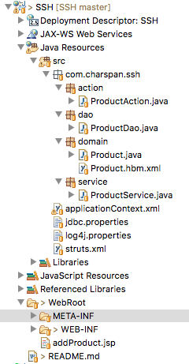

# SSH

## <a href="http://baike.baidu.com/link?url=ViAsF6TGgjP9ZaZIDPsggUEIZiA9k3PPSwUHuAsr0hf0yseeb2PRqN53Xv6dy4gWBqIVeRsxkxd_LUbOaYZqt0v_cXYC32pMQHk6x3c5147">框架介绍</a>

### 项目开发

1. 数据库sql 语句:

~~~~sql
CREATE DATABASE ssh;

CREATE TABLE `product` (
  `pid` int(11) NOT NULL AUTO_INCREMENT,
  `pname` varchar(20) DEFAULT NULL,
  `price` double DEFAULT NULL,
  PRIMARY KEY (`pid`)
) ENGINE=InnoDB DEFAULT CHARSET=utf8;
~~~~

2. 项目结构



3. 核心配置文件

web.xml

```
<?xml version="1.0" encoding="UTF-8"?>
<web-app version="2.5" xmlns="http://java.sun.com/xml/ns/javaee"
	xmlns:xsi="http://www.w3.org/2001/XMLSchema-instance"
	xsi:schemaLocation="http://java.sun.com/xml/ns/javaee 
	http://java.sun.com/xml/ns/javaee/web-app_2_5.xsd">
	<!-- 配置Spring框架核心的监听器 -->
	<listener>
		<listener-class>org.springframework.web.context.ContextLoaderListener</listener-class>
	</listener>
	<context-param>
		<param-name>contextConfigLocation</param-name>
		<param-value>classpath:applicationContext.xml</param-value>
	</context-param>
	<!-- Struts2核心过滤器配置 -->
	<filter>
		<filter-name>struts2</filter-name>
		<filter-class>org.apache.struts2.dispatcher.ng.filter.StrutsPrepareAndExecuteFilter</filter-class>
	</filter>
	<filter-mapping>
		<filter-name>struts2</filter-name>
		<url-pattern>/*</url-pattern>
	</filter-mapping>
	<display-name></display-name>
	<welcome-file-list>
		<welcome-file>addProduct.jsp</welcome-file>
	</welcome-file-list>
</web-app>

```

struts.xml

```
<?xml version="1.0" encoding="UTF-8" ?>
<!DOCTYPE struts PUBLIC
	"-//Apache Software Foundation//DTD Struts Configuration 2.3//EN"
	"http://struts.apache.org/dtds/struts-2.3.dtd">

<struts>

	<package name="ssh" extends="struts-default" namespace="/">
		<action name="product_*" class="productAction" method="{1}">
		
		</action>
	</package>

</struts>
```

applicationContext.xml

```
<?xml version="1.0" encoding="UTF-8"?>
<beans xmlns="http://www.springframework.org/schema/beans"
	xmlns:xsi="http://www.w3.org/2001/XMLSchema-instance" xmlns:context="http://www.springframework.org/schema/context"
	xmlns:aop="http://www.springframework.org/schema/aop" xmlns:tx="http://www.springframework.org/schema/tx"
	xsi:schemaLocation="http://www.springframework.org/schema/beans
        http://www.springframework.org/schema/beans/spring-beans.xsd
        http://www.springframework.org/schema/context
        http://www.springframework.org/schema/context/spring-context.xsd
        http://www.springframework.org/schema/aop
        http://www.springframework.org/schema/aop/spring-aop.xsd
        http://www.springframework.org/schema/tx
        http://www.springframework.org/schema/tx/spring-tx.xsd">

	<!-- 引入外部的属性文件 -->
	<context:property-placeholder location="classpath:jdbc.properties" />

	<!-- 配置连接池 -->
	<bean id="dataSource" class="com.mchange.v2.c3p0.ComboPooledDataSource">
		<property name="driverClass" value="${jdbc.driverClass}" />
		<property name="jdbcUrl" value="${jdbc.url}" />
		<property name="user" value="${jdbc.user}" />
		<property name="password" value="${jdbc.password}" />
	</bean>

	<!-- 配置Hibernate的相关属性 -->
	<bean id="sessionFactory"
		class="org.springframework.orm.hibernate3.LocalSessionFactoryBean">
		<!-- 注入连接池 -->
		<property name="dataSource" ref="dataSource" />
		<!-- 配置Hibernate的属性 -->
		<property name="hibernateProperties">
			<props>
				<prop key="hibernate.dialect">org.hibernate.dialect.MySQLDialect
				</prop>
				<prop key="hibernate.show_sql">true</prop>
				<prop key="hibernate.format_sql">true</prop>
				<prop key="hibernate.hbm2ddl.auto">update</prop>
			</props>
		</property>
		<!-- 加载Hibernate的映射文件 -->
		<property name="mappingResources">
			<list>
				<value>com/charspan/ssh/domain/Product.hbm.xml</value>
			</list>
		</property>
	</bean>

	<!-- 配置Action的类 -->
	<bean id="productAction" class="com.charspan.ssh.action.ProductAction"
		scope="prototype">
		<!-- 手动注入service -->
		<property name="productService" ref="productService" />
	</bean>

	<!-- 配置业务层的类 -->
	<bean id="productService" class="com.charspan.ssh.service.ProductService">
		<property name="productDao" ref="productDao" />
	</bean>

	<!-- 配置DAO层的类 -->
	<bean id="productDao" class="com.charspan.ssh.dao.ProductDao">
		<property name="sessionFactory" ref="sessionFactory" />
	</bean>

	<!-- 配置事务管理器 -->
	<bean id="transactionManager"
		class="org.springframework.orm.hibernate3.HibernateTransactionManager">
		<property name="sessionFactory" ref="sessionFactory" />
	</bean>

	<!-- 开启注解事务 -->
	<tx:annotation-driven transaction-manager="transactionManager" />

</beans>
```

jdbc.properties

```
jdbc.driverClass=com.mysql.jdbc.Driver
jdbc.url=jdbc:mysql://127.0.0.1:3306/ssh
jdbc.user=root
jdbc.password=9k1o2p4dj3H
```

log4j.properties

```
log4j.rootLogger = debug, console, E
#level=INFO,all can be output
#console is set to be a ConsoleAppender
log4j.appender.console = org.apache.log4j.ConsoleAppender
log4j.appender.console.layout = org.apache.log4j.PatternLayout
log4j.appender.console.layout.ConversionPattern = [%p] %d{yyyy-MM-dd HH:mm:ss} - %m%n

#file is set to output to a extra file
log4j.appender.E = org.apache.log4j.DailyRollingFileAppender
log4j.appender.E.layout = org.apache.log4j.PatternLayout
log4j.appender.E.Threshold=error
log4j.appender.E.Encoding=UTF-8
log4j.appender.E.layout.ConversionPattern=[%p] %d{yyyy-MM-dd HH:mm:ss} - %m%n
log4j.appender.E.DatePattern='.'yyyy-MM-dd
log4j.appender.E.File = ${catalina.base}/logs/dd/error.log
```